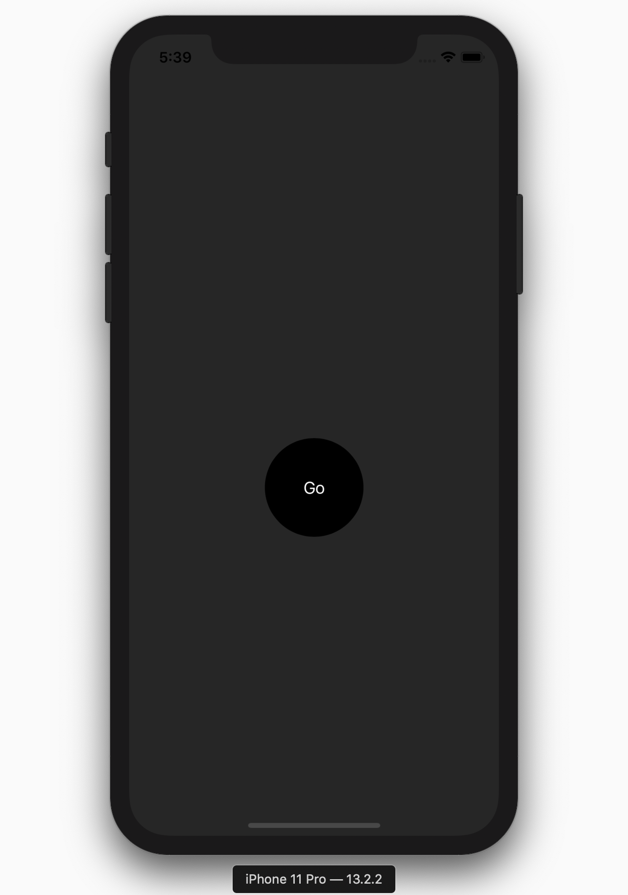
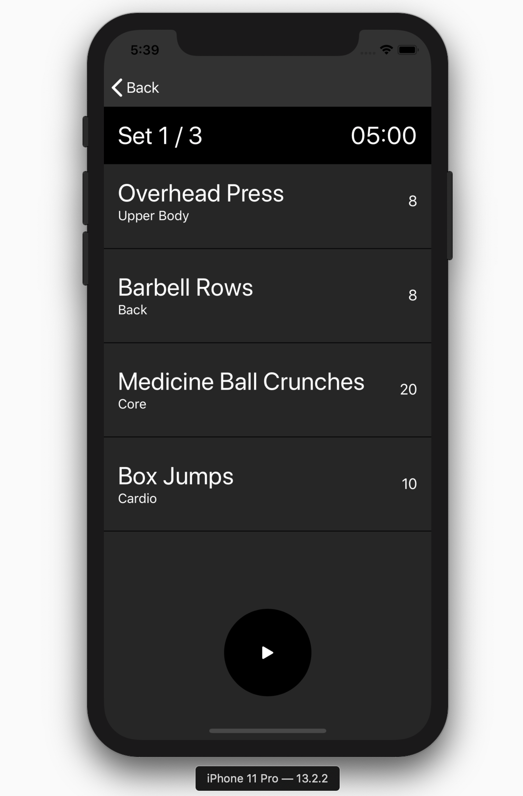

#  Hiit Workout based app

Built with swiftUI

Basically an app I made for managing a workout routine im trying. Its a crossfit style timed ARAP (as many reps as possible) workout. 

The app will pick 4 excercises, one from each of the following catagories back, chest / shoulders, core, and one cardio focused exercise. It will also give you the number of reps of each to performe. You do the exercises one after another with no rest in between as many times as you can in the alloted time. The app also provides a timer to track this. The times are as follows 5 Mins workout -> 5 Mins rest repeat 3 times. So the total workout takes 30 mins with 3 working sets.

The app will let you know when its time to stop and rest and when to start again through various times sounds. 

Roadmap:
* apple watch support
* settings for additional workout times time (easy, moderate, hard, very hard)
* some data persistance to ensure it doesn't assign the same workouts two days in a row
* the ability to enter what equipment you have and adjust the workouts based on that

